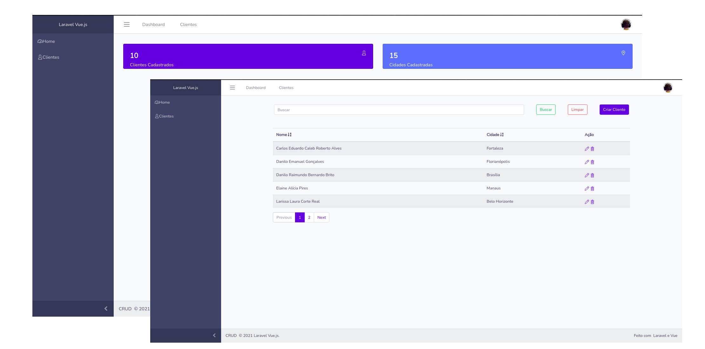

<h1 align="center">
    Crud Laravel Vue
</h1>

  
  
  

  

  

  <a href="#rocket-tecnologias">Tecnologias</a>&nbsp;&nbsp;&nbsp;|&nbsp;&nbsp;&nbsp;
  <a href="#-projeto">Projeto</a>&nbsp;&nbsp;&nbsp;|&nbsp;&nbsp;&nbsp;  

 

  

## :rocket: Tecnologias

Esse projeto foi desenvolvido com as seguintes tecnologias:

- [PHP](https://www.php.net/)
- [Laravel](https://laravel.com/)
- [Vue.js](https://vuejs.org/)
- [Inertia](https://inertiajs.com/)

## 💻 Projeto

Um CRUD com login feito com Laravel e Vue.js.
